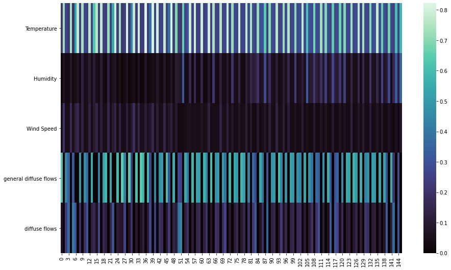
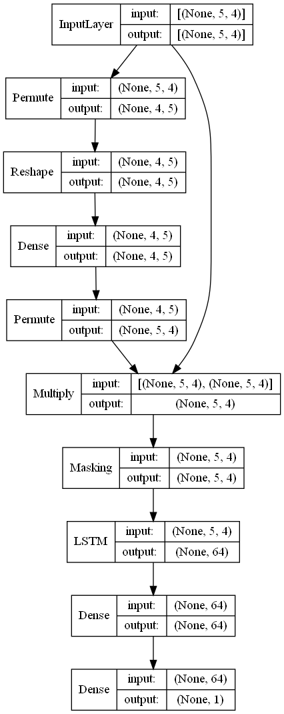

# LSTM with Explainability using an attention layer

In this notebook introduces a prediction using a Long Short-Term Memory (LSTM) with explainability. The data set used is "Power consumption of Tetouan city Data Set" from UCI Machine Learning Repository.

Also a prediction using XGBoost with different explanatory framework named SHAP was used to compare the LSTM with explainability.

Representation of the attention values:

    

Keras architecture:

    

<h2> References </h2>
 <ul>
  <li>Kaji, D. A., Zech, J. R., Kim, J. S., Cho, S. K., Dangayach, N. S., Costa, A. B., & Oermann, E. K. (2019). An attention based deep learning model of clinical events in the intensive care unit. PloS one, 14(2), e0211057.</li>
  <li>Lundberg, S. M., & Lee, S. I. (2017). A unified approach to interpreting model predictions. Advances in neural information processing systems, 30.</li>
  <li>Salam, A., & El Hibaoui, A. (2018, December). Comparison of Machine Learning Algorithms for the Power Consumption Prediction:-Case Study of Tetouan city–. In 2018 6th International Renewable and Sustainable Energy Conference (IRSEC) (pp. 1-5). IEEE.â€</li>
</ul> 

 Data: https://archive.ics.uci.edu/ml/datasets/Power+consumption+of+Tetouan+city 

